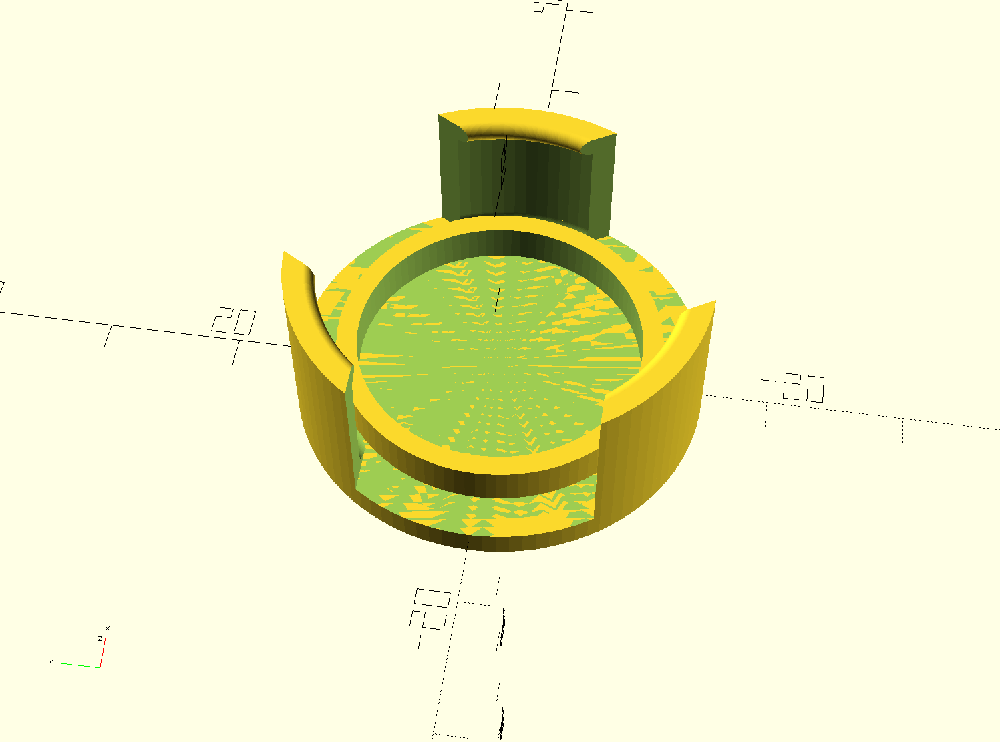
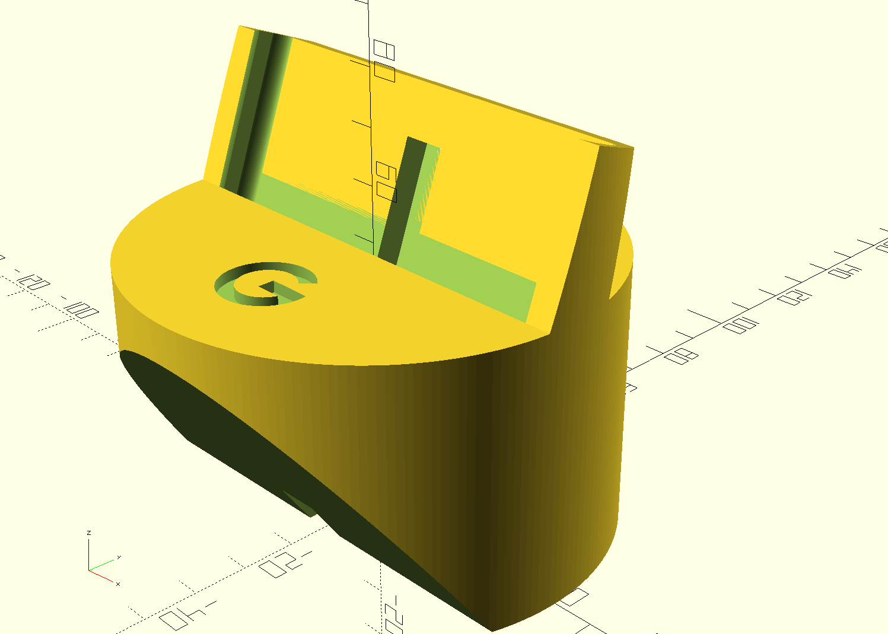
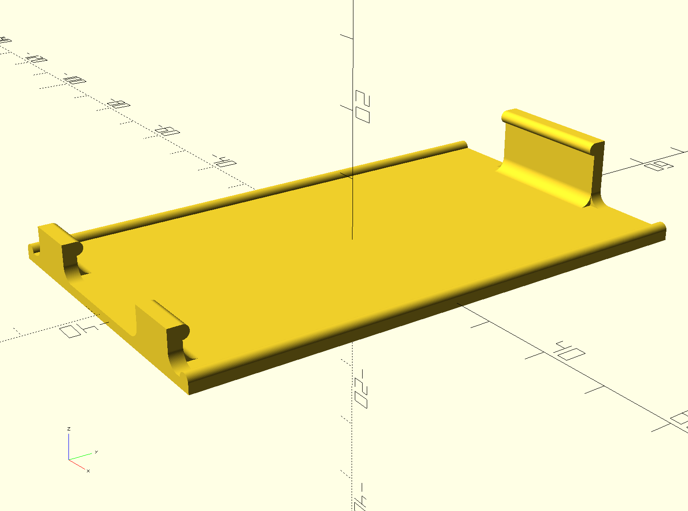
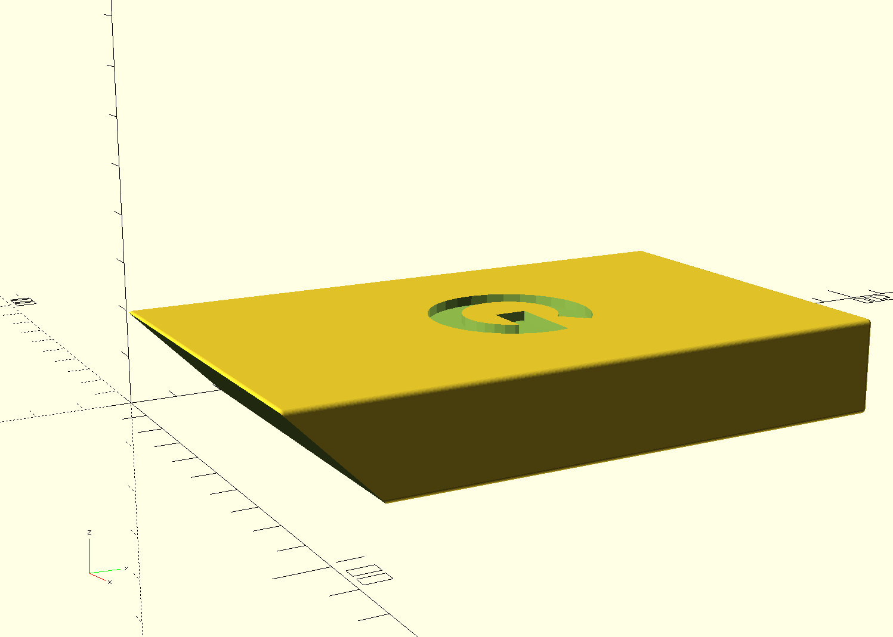
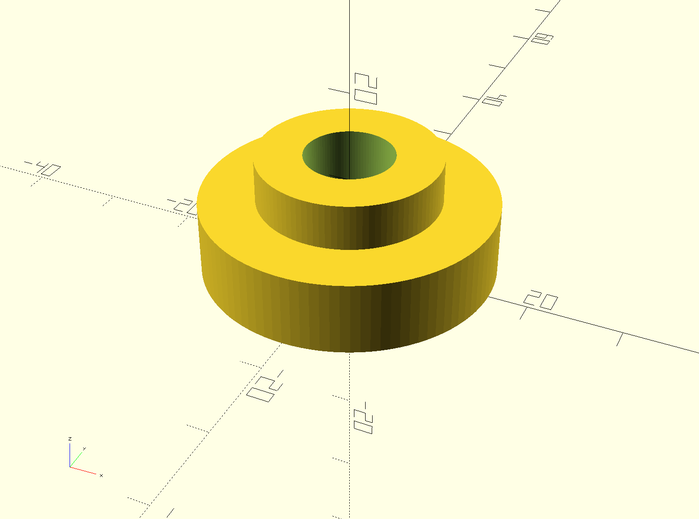
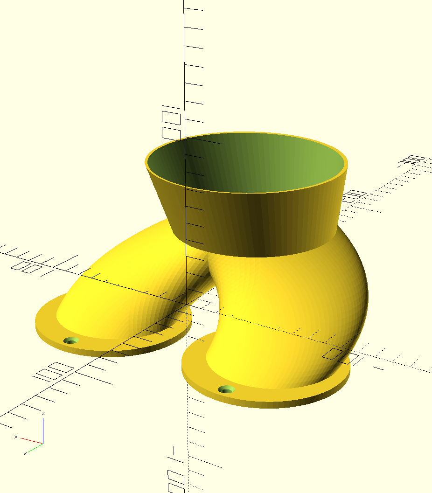

# Various 3D models
This repository contains a collection of models for a 3D printer.
The models are created with [OpenSCAD](https://openscad.org)
and can be converted to STL files with it.

## Bike Light Cover
This model is a cover for small bicycle light (Ruby Diamond).
The cover should avoid an unintended activation of the light,
during transportation in a pocket.

## Cup Holder Phone Dock
This model is a car phone dock for the Pixel 2 XL.
The mount can be put into the cup holder of the car.

## Elemnt Bolt Display Cover
This model should cover the display of the Elemnt Bolt bike navigation.
It should simply avoid scratches in the display during transportation.

## Smartphone Tray Block
This model is a block for the Skoda Octavia 5E smartphone tray.
It should avoid that the smartphone is sliding around in the tray,
if the car curves.

## Bike Bearing Press
This model can be used as bearing press adapter.

## Dryer Fan Channel
This model is for a clothing dryer to create a channel to two air
exhaust panels of the dryer cabinet. This will prevent the dryer to
suck in the exhaust air within the cabinet (air loop). The cabinet is
used to hide the dryer and reduce the noise.

